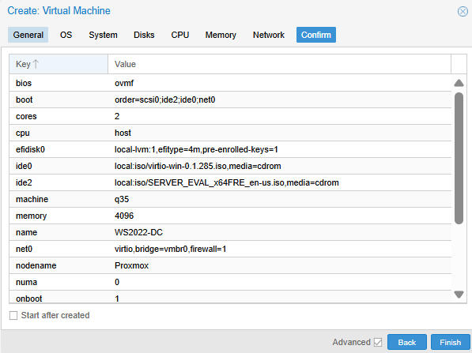
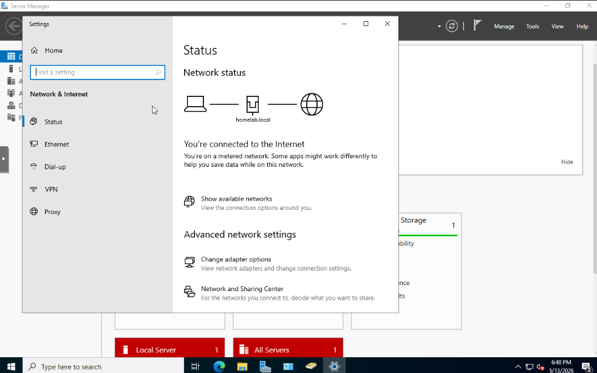
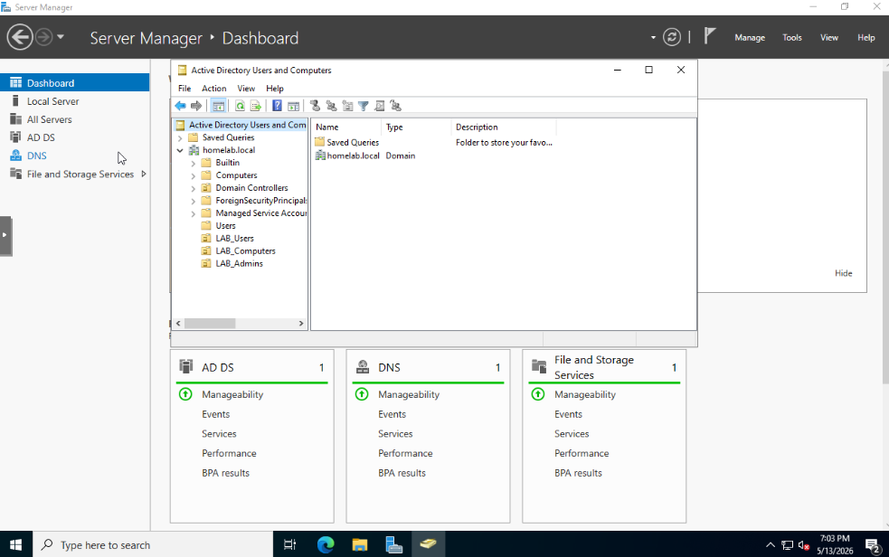
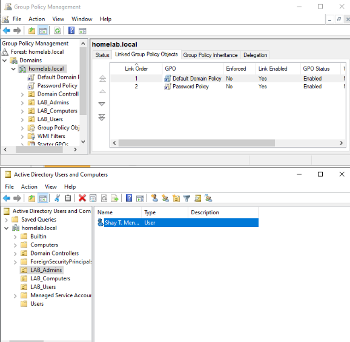

# active-directory-lab
Windows Server 2022 Active Directory domain deployed on Proxmox – step-by-step guide
# Active Directory Domain Lab on Proxmox

## Objective
Deploy a Windows Server 2022 Active Directory domain on Proxmox to understand enterprise identity management, Group Policy, and user administration.

## Technologies Used
- Proxmox VE 8.x
- Windows Server 2022 Standard Evaluation (Desktop Experience)
- Active Directory Domain Services
- Group Policy Management
- Windows 10 client VM

## Lab Topology
| Component          | IP Address      | Role                        |
|--------------------|-----------------|-----------------------------|
| Domain Controller   | 192.168.0.120   | DC, DNS, homelab.local      |
| Client VM           | DHCP            | Domain-joined workstation   |
| Gateway             | 192.168.0.1     | Archer router               |

## Step-by-Step Implementation

### 1. Create the Windows Server VM
- Uploaded Windows Server 2022 and VirtIO ISOs
- Created VM with 4GB RAM, 2 cores, 40GB SCSI disk
- Attached both ISOs and set boot order to CD/DVD first

### 2. Install Windows Server
- Selected Desktop Experience, loaded VirtIO SCSI driver to detect disk
- After first boot, loaded VirtIO network driver for Ethernet
- Set Administrator password: `Homelab2024!`

### 3. Configure Static IP and Promote to Domain Controller
- Set static IP `192.168.0.120/24`, DNS `127.0.0.1`
- Installed AD DS role via Server Manager
- Promoted to a domain controller in a new forest `homelab.local`
- Set DSRM password, ignored DNS delegation warning
- Logged in as `HOMELAB\Administrator`

### 4. Create Organizational Units, Users, and Group Policy
- Created OUs: LAB_Users, LAB_Computers, LAB_Admins
- Added user: Shay T
- Created Password Policy GPO enforcing minimum password length of 8, linked to domain

# 5. Join a Windows 10 Client to the Domain
- Created a Windows 10 VM, set DNS to domain controller IP (192.168.0.120)
- Successfully joined client to `homelab.local`
- Verified login with domain user `jdoe@homelab.local`

